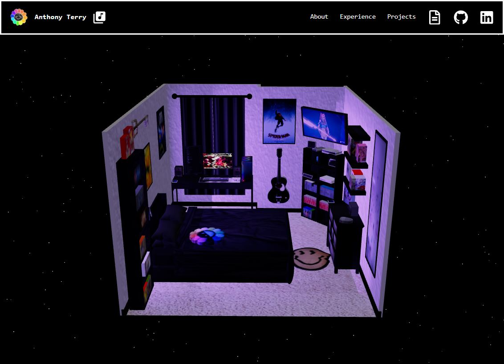

# Portfolio V2

It's cooler.

---


## Instructions

```
pnpm install
pnpm run dev
```

## Goals

- [x] Set up project structure
- [x] Create MVP for website
- [x] Add a music player
- [x] Add top tracks using Last.fm
- [x] LED lighting for room
- [x] Allow videos to be played on model screens
- [x] Revamp the music player as a jukebox
- [x] Project badges for accomplishments
- [ ] Make the model spin when untouched for a while
- [ ] Add recent song played and top artist
- [ ] Add a different modal animation for open and close
- [ ] Add strudel songs in music page
- [ ] Fix glow effect
- [ ] Click TV and have it change channels
- [ ] Click my PC and play a game
- [ ] Try to use unique camera movements for suprises
- [ ] Add blogs section
- [ ] Revamp the room model
- [ ] Change modal designs for different pages (v3.0 potentially)

## Timeline

```
Portfolio
├── v2.00       - New Portfolio Created
│   ├── v2.01   - Super Mario Font
│   └── v2.02   - Loading...
├── v2.10       - Music Player
├── v2.20       - Top Tracks
│   └── v2.21   - LED Lighting
├── v2.30       - Screen Videos
└── v2.40       - Jukebox (Music Player Overhaul)
    └── v2.41   - Project Badges
    └── v2.42   - Minecraft Font
```

## Inspiration

[Sooah's Portfolio](https://www.sooahs-room-folio.com/)

[Rachel Wei's Portfolio](https://rachelqrwei.ca/)

[Rafael Niebles Portfolio](https://www.rnieb.dev/)

[Katherina Dayaon's Portfolio](https://katherinadayaon.me/)
