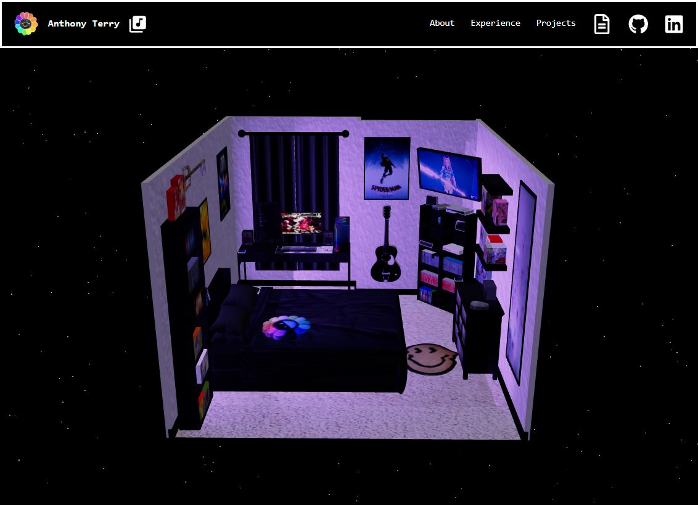

# Portfolio V2

It's cooler.

---


## Instructions

```
pnpm install
pnpm run dev
```

## Goals

- [x] Set up project structure
- [x] Create MVP for website
- [x] Add a music player
- [x] Add top tracks using Last.fm
- [x] LED lighting for room
- [x] Allow videos to be played on model screens
- [x] Revamp the music player as a jukebox
- [x] Project badges for accomplishments
- [x] Make the model spin when untouched for a while
- [x] Add recent song played and top albums
- [x] Add unique tooltip UI for pc and mobile
- [ ] Add a different modal animation for open and close
- [ ] Add strudel songs in music page
- [ ] Fix glow effect
- [ ] Click TV and have it change channels
- [ ] Click my PC and play a game
- [ ] Try to use unique camera movements for suprises
- [ ] Add blogs page
- [ ] Revamp the room model
- [ ] Change modal designs for different pages (v3.0 potentially)

## Timeline

```
Portfolio
├── v2.00       - New Portfolio Created
│   └── v2.01   - Loading...
├── v2.10       - Music Player
├── v2.20       - Top Tracks
│   └── v2.21   - LED Lighting
├── v2.30       - Screen Videos
└── v2.40       - Jukebox (Music Player Overhaul)
    └── v2.41   - Project Badges
    └── v2.42   - AFK Model Spin
    └── v2.43   - Last Played & Top Albums
    └── v2.43   - Record Player Music Page
```

## Notes

For projects page, make it look like a computer screen and each project is a folder. The user clicks the folder and it opens another modal showcasing the project, this time with more info, like specific team members, timeline on how it was created, etc.

For experience page, make it go to the TV and act like a news channel is on. On the news channel could be my different experiences I've gotten and stuff like that.

For music, I can make it go to my vinyl player that will be added to the updated model or the guitar.

## Inspiration

[Sooah's Portfolio](https://www.sooahs-room-folio.com/)

[Rachel Wei's Portfolio](https://rachelqrwei.ca/)

[Rafael Niebles Portfolio](https://www.rnieb.dev/)

[Katherina Dayaon's Portfolio](https://katdayaon.art/)
